### doing it for the $${\color{pink}love}$$ of the $${\color{lightblue}game }$$

<a href="https://github.com/pymmog">
  
</a>
<a href="https://github.com/pymmog">
  
</a>

```
⡏⠉⠉⠉⠉⠉⠉⠋⠉⠉⠉⠉⠉⠉⠋⠉⠉⠉⠉⠉⠉⠉⠉⠉⠉⠙⠉⠉⠉⠹
⡇⢸⣿⡟⠛⢿⣷⠀⢸⣿⡟⠛⢿⣷⡄⢸⣿⡇⠀⢸⣿⡇⢸⣿⡇⠀⢸⣿⡇⠀
⡇⢸⣿⣧⣤⣾⠿⠀⢸⣿⣇⣀⣸⡿⠃⢸⣿⡇⠀⢸⣿⡇⢸⣿⣇⣀⣸⣿⡇⠀
⡇⢸⣿⡏⠉⢹⣿⡆⢸⣿⡟⠛⢻⣷⡄⢸⣿⡇⠀⢸⣿⡇⢸⣿⡏⠉⢹⣿⡇⠀
⡇⢸⣿⣧⣤⣼⡿⠃⢸⣿⡇⠀⢸⣿⡇⠸⣿⣧⣤⣼⡿⠁⢸⣿⡇⠀⢸⣿⡇⠀
⣇⣀⣀⣀⣀⣀⣀⣄⣀⣀⣀⣀⣀⣀⣀⣠⣀⡈⠉⣁⣀⣄⣀⣀⣀⣠⣀⣀⣀⣰
⣇⣿⠘⣿⣿⣿⡿⡿⣟⣟⢟⢟⢝⠵⡝⣿⡿⢂⣼⣿⣷⣌⠩⡫⡻⣝⠹⢿⣿⣷
⡆⣿⣆⠱⣝⡵⣝⢅⠙⣿⢕⢕⢕⢕⢝⣥⢒⠅⣿⣿⣿⡿⣳⣌⠪⡪⣡⢑⢝⣇
⡆⣿⣿⣦⠹⣳⣳⣕⢅⠈⢗⢕⢕⢕⢕⢕⢈⢆⠟⠋⠉⠁⠉⠉⠁⠈⠼⢐⢕⢽
⡗⢰⣶⣶⣦⣝⢝⢕⢕⠅⡆⢕⢕⢕⢕⢕⣴⠏⣠⡶⠛⡉⡉⡛⢶⣦⡀⠐⣕⢕
⡝⡄⢻⢟⣿⣿⣷⣕⣕⣅⣿⣔⣕⣵⣵⣿⣿⢠⣿⢠⣮⡈⣌⠨⠅⠹⣷⡀⢱⢕
⡝⡵⠟⠈⢀⣀⣀⡀⠉⢿⣿⣿⣿⣿⣿⣿⣿⣼⣿⢈⡋⠴⢿⡟⣡⡇⣿⡇⡀⢕
⡝⠁⣠⣾⠟⡉⡉⡉⠻⣦⣻⣿⣿⣿⣿⣿⣿⣿⣿⣧⠸⣿⣦⣥⣿⡇⡿⣰⢗⢄
⠁⢰⣿⡏⣴⣌⠈⣌⠡⠈⢻⣿⣿⣿⣿⣿⣿⣿⣿⣿⣿⣬⣉⣉⣁⣄⢖⢕⢕⢕
⡀⢻⣿⡇⢙⠁⠴⢿⡟⣡⡆⣿⣿⣿⣿⣿⣿⣿⣿⣿⣿⣿⣿⣿⣿⣿⣷⣵⣵⣿
⡻⣄⣻⣿⣌⠘⢿⣷⣥⣿⠇⣿⣿⣿⣿⣿⣿⠛⠻⣿⣿⣿⣿⣿⣿⣿⣿⣿⣿⣿
⣷⢄⠻⣿⣟⠿⠦⠍⠉⣡⣾⣿⣿⣿⣿⣿⣿⢸⣿⣦⠙⣿⣿⣿⣿⣿⣿⣿⣿⠟
⡕⡑⣑⣈⣻⢗⢟⢞⢝⣻⣿⣿⣿⣿⣿⣿⣿⠸⣿⠿⠃⣿⣿⣿⣿⣿⣿⡿⠁⣠
⡝⡵⡈⢟⢕⢕⢕⢕⣵⣿⣿⣿⣿⣿⣿⣿⣿⣿⣶⣶⣿⣿⣿⣿⣿⠿⠋⣀⣈⠙
⡝⡵⡕⡀⠑⠳⠿⣿⣿⣿⣿⣿⣿⣿⣿⣿⣿⣿⣿⣿⣿⠿⠛⢉⡠⡲⡫⡪⡪⡣
```


> [!IMPORTANT]
> 
